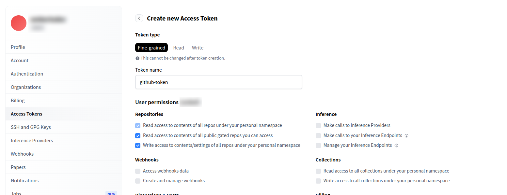

<p align="center">
   
</p>

# IHaveAStream

This is a **Stremio addon** that integrates external video streams into the platform.
It was created with the idea of making sports content a little more accessible to everyone, given the often unreasonable rise in subscription costs.
Of course, if you can afford it, it is always recommended to subscribe to the official services to support the platforms and content creators.
However, this is an **unstable and hard-to-maintain solution**: streams may change or stop working at any time.  
Apologies in advance for any possible malfunctions.

## Current functionality

| Provider       | Status |
|----------------|:-----:|
| [Rojadirecta](https://www.rojadirecta.eu) | ✅ |
| [Matchstream](https://www.matchstream.do)  | ✅ |

🔹 **Future goals**  
- The architecture is designed to be modular, making it easy to add **new streaming providers** beyond single provider.  
- The aim is to keep the addon flexible and expandable, supporting multiple content sources without changing the core logic.  

---

## Project status
The project is currently in its early stage but the structure is ready to grow.  

---

## Disclaimer
This addon does not host or distribute any content directly: it only collects and organizes streams already publicly available online through the integrated providers.  

The use of these sources is at the user’s sole discretion.  
Any misuse, including unauthorized access to copyrighted material, is the **sole responsibility of the user**, not of the addon or its developers.

---

## Limitations
At the moment, the addon **discards (rejects) all m3u8 video streams that use encryption (e.g. AES-128, SAMPLE-AES)**.  

The reason is that, in most cases, access to decryption keys is deliberately made complicated by providers.  
Handling the different ways keys are distributed is complex and highly inconsistent, especially since there may be many providers with very different implementations.  

As a result, only **unencrypted streams** are processed and made available, while encrypted ones are skipped.


# Instal
## Run on local
``` 
npm i 
npm start
```
## Run with docker
``` 
docker compose up -d
```
## Run on Hugging Face space
✅ **Step-by-step: Deploy your Space to Hugging Face**

1. 👤 **Create an account** on Hugging Face [here](https://huggingface.co/join).

2. 🚀 **Create a new Space** [here](https://huggingface.co/new-space)  
   - Select ***Docker + Blank*** as the Space SDK  
   - Make it **public**
   
   

3. 🍴 **Fork the repository**  
   - Click ***Fork*** → ***Create New Fork*** → ***Create One*** (it's not necessary make it public)

4. 🔑 **Create a new HF token** [here](https://huggingface.co/settings/tokens) and **copy** it  
   - Check all permissions related to ***Repositories***:  
     - Read access to contents of all repos under your personal namespace  
     - Read access to contents of all public gated repos you can access  
     - Write access to contents/settings of all repos under your personal namespace
     
     

5. ⚙️ **Add secrets and variables**  
   - Go to ***Settings*** → ***Secrets and variables*** → ***Actions***  
   - **Secrets tab:** add a new ***Repository secret***  
     - `HF_TOKEN` → set its value to the token you created  
   - **Variables tab:** add 2 ***Repository variables***  
     - `HF_USER` → your Hugging Face username (the space owner)
     - `HF_REPO` → the name of your Hugging Face Space (***my-new-space*** in my case)
     
     

6. ▶️ **Run the workflow**  
   - Go to ***Actions*** → select ***Deploy to Hugging Face Space*** → click ***Run workflow***
   

7. 🌐 **Use your Space**
   - In the **Manage Domains** section, you can enable or disable the various providers that will be added
   - Once the Space is running, you can install the addon on your Stremio client using ***Automatic Install***, ***Web Install***, or by copying the ***manifest.json*** link directly.
   
   - In the **Configure** section, you can manage the individual providers that will be used to fetch sports events. Each time you update the addon, the status of the providers will be reset and reactivated.
   
⚠️ **Note:** If you make updates, simply click **Sync Changes** in your GitHub repo. The workflow will automatically redeploy the changes via GitHub Actions.